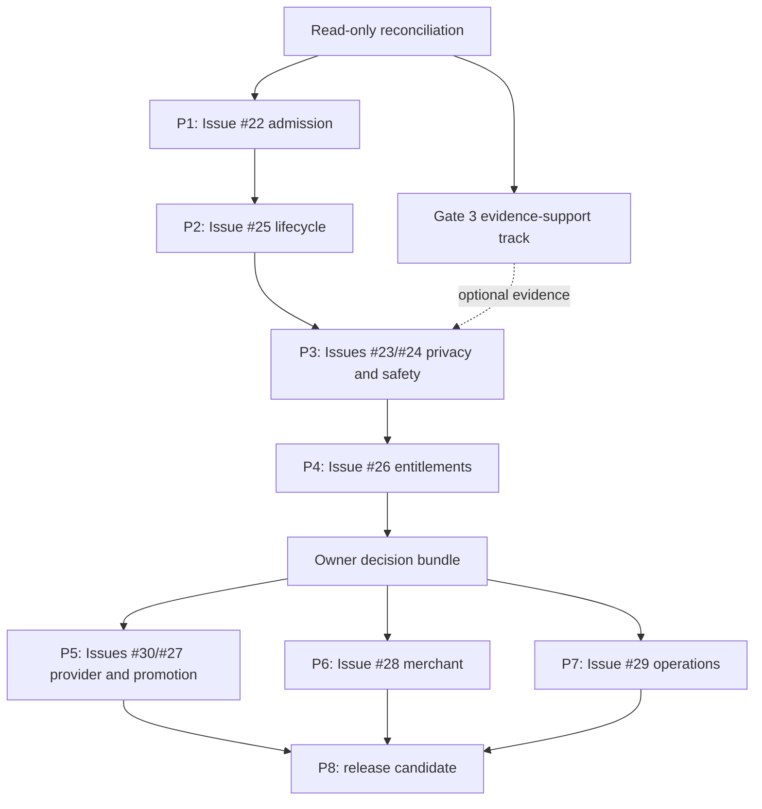

# Aromatika master plan and progress control record

**Status date:** 23 August 2026, Europe/Sofia

**Repository:** `todevan/perfume-marketplace-bg`

**Purpose:** Dated orientation, roadmap, evidence ledger, and agent handoff assembled from the supplied context packet and a read-only reconciliation.

> [!IMPORTANT]
> **This is point-in-time orientation, not repository authority, live proof, or standing authorization.** Product and engineering decisions remain in the current authority documents listed in section 3. Git, GitHub, CI, Supabase, Cloudflare, mailbox, payment-provider, deployment, and backup state must be reread for the exact target and SHA before use. Embedded prompts are bounded templates only; selecting one does not authorize work or any hosted action. Volatile claims below are historical unless explicitly identified as freshly rechecked on 2026-08-23.

## 1. Executive verdict

Aromatika is a Bulgaria-first marketplace for selling, exchanging, and finding perfume. Its trust model centers on one real bottle at a time, structured bottle facts, exact remaining volume, role-specific photo evidence, seller history, structured offers, accepted-deal chat, and audited safety operations.

The repository contains substantial marketplace foundations: listings and evidence, catalog and discovery, favorites, offers, accepted-deal chat, reports, moderation, notifications, merchant scaffolding, and payment-entitlement scaffolding. Those surfaces do not prove an end-to-end launch journey.

**Launch verdict: `BLOCKED`.** No single readiness percentage is used. Item ratios below measure only their named inventory and are not estimates of launch readiness.

Primary blockers recorded by the supplied packet are open registration, the mutual-completion contradiction, cross-user privacy and blocking, complete moderation proof, paid entitlements and promotion, merchant policy, operational recovery, legal approval, provider and pricing decisions, and final launch approval. Unless freshly verified, defect details, hosted inventories, test totals, provider flags, and deployment claims are historical leads rather than current facts.

## 2. Evidence dashboard

### 2.1 Objective progress bars

```text
Gate 3 recorded verified tasks   8 / 14  ██████░░░░  57%
Gate 3 code-present tasks        9 / 14  ██████▍░░░  64%
Launch issues closed             0 / 9   ░░░░░░░░░░   0%
Golden journeys at grade A       0 / 5   ░░░░░░░░░░   0%
```

The first two ratios describe the Gate 3 branch record. The `0 / 9` issue ratio is verified by the 2026-08-23 GitHub check. The `0 / 5` journey ratio records that the supplied and reconciled evidence contains no current grade-A proof for any complete golden journey; it is not a GitHub result or evidence that those journeys were executed on 2026-08-23. None is a launch-readiness percentage, and implementation presence never substitutes for acceptance evidence.

### 2.2 Domain snapshot

| Domain | State in this dated record | Grade | Reading |
|---|---|---:|---|
| Identity/admission | `BLOCKED` | D | Issue #22 and its diverged draft PR require current reconciliation and hosted proof. |
| Core marketplace | `BLOCKED` | C | Major surfaces exist; seller-only completion remains the leading transaction contradiction. |
| Privacy/safety | `NOT FRESHLY VERIFIED` | C | Strong foundations exist; blocking and exact-target denial/moderation proof remain open. |
| Merchant trust | `BLOCKED` | D | Policy, evidence taxonomy, retention, and full journey are not approved/proven. |
| Monetization | `BLOCKED` | D | Provider-neutral scaffolding is not provider activation or entitlement proof. |
| Operations/recovery | `BLOCKED` | C | Tooling and documentation exist; current alert/restore proof is absent. |
| UX/accessibility | `NOT FRESHLY VERIFIED` | C | Design authority exists; complete Bulgarian mobile/accessibility proof is absent. |
| Legal/governance | `BLOCKED` | D | Legal, commercial, retention, and final go-live decisions remain protected. |

### 2.3 Counters

| Counter | Dated value | Meaning |
|---|---:|---|
| Launch issues | 0 of 9 closed | Issues #22–#30 were open in the 2026-08-23 read-only check. |
| Golden journeys | 0 of 5 at grade A | No complete journey had current exact-target evidence in the supplied record. |
| Gate 3 tasks | 8 of 14 recorded verified | Tasks 1–8 had branch-plan records at parent `f696864…`. |
| Gate 3 code | 9 of 14 present | Task 9 code exists at `3a481d…`, but completion is not established. |

## 3. Truth model and authority

Claims occupy separate lanes: approved intent, implemented source, exact-SHA local verification, exact-SHA CI, exact-target hosted verification, and production activation. Never infer a later lane from an earlier one.

Gate states are `PASS`, `BLOCKED`, and `NOT FRESHLY VERIFIED`. Evidence grades are:

- **A:** exact current hosted proof binding target, SHA, configuration/migrations, fixtures, receipts, CI, and required reviews;
- **B:** exact current local and CI proof, with required hosted proof absent;
- **C:** partial implementation or evidence;
- **D:** historical proof, old SHA, scaffold, schema, design, or unmerged branch;
- **E:** unsupported assertion or unknown state.

A hosted-required gate passes only at A. Grade B may provide sufficient evidence for an already-authorized next engineering step; it does not itself authorize work.

Current authority order is: explicit owner instruction; intentional current local state after unknown work is preserved; `docs/AROMATIKA-LAUNCH-READINESS-DESIGN.md`; root `AGENTS.md`; concern-specific authorities (`PRODUCT.md`, `DESIGN.md`, `docs/ARCHITECTURE.md`, `docs/PROJECT-STATUS.md`, `docs/LAUNCH-GATES.md`, `docs/BUSINESS-MODEL.md`, and agent rules); active issue/approved plan; GitHub `main`; historical material including this record.

`docs/PROJECT-STATUS.md` and GitHub remain current progress sources. Task-specific plans and reports hold execution checkpoints. The YAML in section 22 is illustrative and is not a new state store.

## 4. Read-only Git/GitHub correction (2026-08-23)

Freshly captured evidence at `2026-08-23T08:44:22+03:00`:

| Item | Verified value |
|---|---|
| `origin/main` | `747decc3a23385b3c9f0569f8f60327a23424221` |
| Gate 3 branch | `codex/gate3-hosted-orchestrator-design` |
| Gate 3 head | `3a481d48b6faed64dca24981a9c6ba098dcb3c70` |
| Branch relation | 43 ahead, 0 behind `origin/main`; local branch/upstream 0/0 |
| Preserved untracked paths | `.playwright-mcp/`, `aromatika-desktop-smoke.png`, `aromatika-mobile-smoke.png`, `staging-desktop-login.png`, `staging-mobile-login.png` |
| Gate 3 plan | `docs/superpowers/plans/2026-08-20-gate3-hosted-orchestrator.md` |
| Plan blob | `bb2ff08d937f15aba24cb4d3a4646206bab8ba9d` |
| Gate 3 PR/workflow | No associated PR or workflow run found for `3a481d…` |
| PR #33 | Open draft, `73fd29d…`, 11 ahead/18 behind `main`, 68 files |
| PR #34 | Open generated-tooling PR, `d3e85a5…`, diverged at 12 ahead/18 behind `main`, 12 files |
| Issues #22–#30 | All open |
| Active `main` ruleset | Pull request required; branch must be up to date; conversations must be resolved; `app` and `database` checks required; no bypass actor |

Task 9 code is present across exactly six files: lifecycle, scenario runner, operator, and their three tests. Inspection of the code shape indicates lifecycle selects the scenario checkpoint and passes that selection to the runner. However, lifecycle and its test were added beyond the original four-file task scope. Scope authority, focused/broad tests, independent engineering review, adversarial R2 review, CI, and required evidence are not established. Task 9 is not complete.

Links: [repository](https://github.com/todevan/perfume-marketplace-bg), [`main`](https://github.com/todevan/perfume-marketplace-bg/commit/747decc3a23385b3c9f0569f8f60327a23424221), [Gate 3 head](https://github.com/todevan/perfume-marketplace-bg/commit/3a481d48b6faed64dca24981a9c6ba098dcb3c70), [PR #33](https://github.com/todevan/perfume-marketplace-bg/pull/33), and [PR #34](https://github.com/todevan/perfume-marketplace-bg/pull/34).

## 5. What Aromatika is

Aromatika is a Bulgarian community marketplace for perfume enthusiasts, collectors, private buyers/sellers, swap participants, and legitimate merchants. Its unit is a specific physical perfume item, not generic inventory.

It is not a retailer, checkout/escrow platform, courier-booking product, dropshipping catalog, social feed, subscription product at launch, or authenticity guarantor. Bulgaria and Bulgarian are launch defaults. Trust comes from structured facts, private sanitized evidence, seller history, offers, deal state, reports, blocking, case-bound AAL2 moderation, audit, and honest language such as “Evidence reviewed.”

## 6. Users, roles, and visibility

Visitors access intentionally public surfaces. Active normal users list, discover, offer, chat after acceptance, use approved terminal actions, report, block, review, comment, and apply for merchant verification. `account_kind` (`private`/`merchant`) is separate from `platform_role` (`user`/`moderator`/`admin`) and from Verified Merchant status.

Public identity is allowlisted. Email, phone, Auth metadata, private evidence, reports, staff notes/security fields, provider identifiers, drafts, and conversations remain private.

## 7. Admission and account lifecycle

Approved flow: `email/password signup -> email confirmation -> username + meaningful city + current consents -> active account`. Normal users require no invite, waitlist, manual approval, phone/SMS, payment, or merchant approval. Staff/admin require MFA/AAL2. Suspended or revoked accounts must not be reactivated by open registration.

## 8. Catalog and listing model

The supplied baseline describes a curated brand/alias/collection catalog, canonicalization workflow, audience/segment/concentration normalization, optional constrained outbound references, and no scraping.

Listings are `offer` or `wanted`; launch offers cover retail bottles, testers, and official samples with sale/swap/mixed modes. Offers bind one owned item, exact volume, evidence, city, terms, lifecycle, and provenance. Wanted posts do not require evidence and do not consume the commercial allowance. Money uses integer minor units. Drafts are private; active publication requires validated facts and finalized evidence.

These summaries do not replace `PRODUCT.md`.

## 9. Evidence and upload security

Evidence roles differ for open bottles/testers, sealed products, and official samples. The intended boundary is private quarantine, content validation, safe re-encoding and metadata stripping, hashing, private finalized derivative, original deletion, atomic role binding, and exact cleanup of abandoned work.

Browser MIME, filenames, paths, ownership, and finalization claims are untrusted. Private paths are never permanent public URLs. Report evidence is a separate private lifecycle restricted to uploader and correctly assigned AAL2 staff.

## 10. Discovery

Launch discovery uses PostgreSQL full-text/trigram search, aliases, typed filters, deterministic sorting, stable slugs, and keyset pagination. Favorites and saved searches remain user-scoped and RLS-protected. Vector search and AI recommendations are not launch requirements.

## 11. Offers, deals, chat, cancellation, and reviews

Offers may be cash, swap, or mixed. Seller acceptance is atomic, verifies ownership/eligibility, prevents self-dealing and races, reserves relevant listings, creates one deal/conversation, and authorizes only participants.

Approved terminal behavior is seller-only completion or either-party cancellation with stored reason. Buyer/outsider completion and duplicate/racing terminal actions fail closed. Completion unlocks applicable reviews; cancellation does not. General profile comments remain separate from transaction reviews.

## 12. Safety, moderation, and audit

Reports may target relevant public/private marketplace objects. Blocking must stop prohibited contact while preserving evidence and history. Private staff access requires platform role, AAL2, case assignment/state, a supported target-specific action, rationale, and append-only audit. Staff cannot browse arbitrary conversations/evidence. Reporter status must not leak staff notes, paths, or private data.

## 13. Verified Merchant

Verified Merchant is a protected evidence-based trust decision, separate from account kind and payment. The intended flow is application, declarations/private evidence, assigned AAL2 review, correction/approve/reject, and public projection. Exact evidence categories, criteria, correction rules, and retention remain owner/legal policy decisions and are not adopted by this record.

## 14. Business model and money boundary

Perfume payment/delivery remains off-platform. Aromatika charges only for its services: ten simultaneous free qualifying active offer listings, a trusted individual 30-day entitlement for each additional qualifying listing, and time-limited clearly labeled promotion. Wanted does not count. Entitlements are server-authoritative and require trusted provider confirmation. Verification cannot be purchased. No merchant subscription is required at launch.

Exact provider, prices, promotion terms, refund/chargeback handling, accounting, and activation remain protected decisions in `docs/BUSINESS-MODEL.md` and the owner backlog.

## 15. Design and UX authority

`DESIGN.md` remains the sole visual/UX authority. The supplied “Community Bottle Ledger” summary emphasizes warm editorial precision, bottle/evidence/seller/deal facts kept together, mobile-first Bulgarian copy, honest states, accessibility, and no fabricated activity or authenticity guarantees. This record does not restate or amend the token system.

## 16. Technical architecture

Aromatika is a SvelteKit/Svelte modular monolith deployed to Cloudflare with Supabase PostgreSQL/Auth/private Storage/Realtime/RPC/RLS. Parsed contracts feed services, repositories/RPCs, and database enforcement. Routes own HTTP/session semantics. Browser code renders authorized data and is never the security boundary. Runtime uses request-scoped clients and fails closed outside explicit local demo mode.

Hosted operation is capability-separated: read-only inspection establishes fresh truth; lifecycle selects one exact boundary; a runner receives only that capability; targeted read-back precedes manifest evidence and orchestration state. Uncertain mutation stops for fresh inspection.

## 17. Data model map

| Group | Records |
|---|---|
| Admission/legal | Auth events, consent events, legal documents, memberships, legacy invites |
| Identity/catalog | Profiles/public projection, brands, aliases, fragrances, catalog sync |
| Listings/evidence | Listings, photos, quarantine uploads, cleanup queue |
| Discovery/trading | Favorites, saved searches, offers, deals, locks, legacy confirmations |
| Communication/reviews | Conversations, members, messages, transaction reviews, profile comments |
| Safety/merchant | Reports, report evidence, authenticity reviews, audit, merchant applications/status |
| Notifications/billing | Notifications, delivery ledger, payments/events/refunds/entitlements |

Applied migrations are immutable; all changes use forward migrations. Legacy names do not redefine current product truth.

## 18. Implemented surface and gaps

The supplied packet maps implementation surfaces for admission, catalog, listings, evidence, discovery, offers, chat, deals, safety, merchant, notifications, monetization, operations, and legal. Treat those implementation and defect assertions as historical until checked against the current exact SHA. Current durable priorities come from issues #22–#30 and `docs/PROJECT-STATUS.md`, not this table.

| Area | Dated gap signal | Gate |
|---|---|---:|
| Admission | Reconcile open-registration work and prove exact hosted journey | #22 |
| Privacy/safety | Three-user denial, blocking, report/moderation journey | #23/#24 |
| Deals | Seller-only completion and reasoned cancellation | #25 |
| Monetization | Trusted extra-listing and promotion entitlements/provider | #26/#27/#30 |
| Merchant | Approved evidence policy and end-to-end review | #28 |
| Operations | Alerts, restore, secrets, environment separation | #29 |

## 19. Canonical golden journeys

1. Core: register through seller completion and review.
2. Cancellation: either participant cancels with reason; review remains locked.
3. Safety: report/block through assigned AAL2 decision, audit, and safe reporter status.
4. Monetization: ten free offers, trusted entitlement for the 11th, expiry/revocation.
5. Merchant: application/evidence through protected review and public status, separate from payment.

All five remain `BLOCKED` in this dated record because grade-A exact-target proof was absent.

## 20. Gate 3 status and remaining plan

Gate 3 is staging-only evidence infrastructure. It contributes receipts to product/security gates and receives no independent launch-readiness weight.

| Task | Outcome | Dated state |
|---:|---|---|
| 1–8 | Run state, locks, secrets, lifecycle, inspector, CLI/preflight, A9 provisioning, exact upload cleanup | Recorded complete/reviewed at `f696864…`; revalidate before relying on it. |
| 9 | A10 registry and one-boundary scenario runner | Six-file code present at `3a481d…`; lifecycle selects checkpoint; original four-file scope exceeded; authority/reviews/tests/CI/evidence incomplete. |
| 10 | Thin Playwright evidence, mock flow, scenario-8 crash matrix | Planned, not established present. |
| 11 | Exact cleanup/archive completion | Planned. |
| 12 | Explicit recovery wrapper | Planned. |
| 13 | CLI wiring, compatibility, operator documentation | Planned. |
| 14 | Full verification and independent R2 reviews | Not complete. |
| Hosted acceptance | One exact staging lifecycle | Owner-gated; not authorized or proven here. |

The plan path/blob verified on 2026-08-23 is `docs/superpowers/plans/2026-08-20-gate3-hosted-orchestrator.md` / `bb2ff08d937f15aba24cb4d3a4646206bab8ba9d`. Revalidate both and locate explicit Task 9 scope authority before use.

## 21. Master milestone roadmap

Authoritative issue ordering keeps **#22 before #25**. Issue #25 is the leading transaction-model contradiction, not the next authorized task by this record.



Prefer one active task owner. Parallelize only genuinely independent work under the repository workflow. Gate 3 does not displace the product queue or authorize hosted action. Because current Gate 3 Task 9 verification and issue #22 both depend on reconciling overlapping branch/scope state, do not run those two tasks in parallel: reconcile and close or checkpoint the selected task first. The product sequence remains #22, then #25, then privacy/safety, entitlements, owner decisions, provider/promotion, merchant, operations, and exact-candidate release verification.

## 22. Illustrative checkpoint ledger

This template is a reporting aid, **not a state store or authorization artifact**.

```yaml
checkpoint_id: CP-YYYYMMDD-NN
task: one exact outcome
risk: R0 | R1 | R2 | R3
authority:
  owner_instruction: exact reference
  design: exact path and section
  issue_or_plan: exact path or URL
git:
  worktree: exact path
  branch: exact branch
  merge_base: exact SHA
  start_head: exact SHA
  end_head: exact SHA
  sync_status: Synchronized | Local ahead | Remote ahead | Diverged
scope:
  allowed_files: exact list
  excluded_work: exact list
evidence:
  red: command and intended failure, or not applicable
  green: command and result, or not applicable
  broader_tests: commands and results
  database_or_rls: commands and results, or not applicable
  e2e: commands and results, or not applicable
  engineering_review: reviewer and verdict
  security_review: reviewer and verdict, or not applicable
  ci: run URL and exact SHA
  hosted: target/run/receipt, not required, or not authorized
gate:
  state: PASS | BLOCKED | NOT FRESHLY VERIFIED
  grade: A | B | C | D | E
remaining_findings: []
owner_action: none or one exact protected action
next_task: one exact bounded task
stop_condition: why work stops here
```

Evidence is stale after any relevant product rule, code, migration, configuration, target, release, provider setting, fixture, secret boundary, or acceptance requirement changes. A formal freshness duration is a proposed decision, not an adopted rule; until approved, relevant change invalidates the evidence.

## 23. One-task agent prompt library

> [!CAUTION]
> These are task templates, not standing instructions or authorization. Before using one, re-read authorities, reconcile the exact worktree, confirm task priority/scope, and satisfy R2/R3 gates. Select one template for each task owner. Parallel work is allowed only for genuinely independent tasks under the repository workflow; Gate 3 Task 9 verification and issue #22 are not currently independent and must not run in parallel.

### Global guardrail template

```text
Work on one bounded Aromatika task and stop after its verified handoff. Read root and applicable directory AGENTS.md plus current product, architecture, security, issue/spec/plan authorities. Start read-only: reconcile worktree, Git, upstream, origin/main, open PR/issue state, and unknown files. Preserve unknown work; never hard-reset, clean, rewrite applied migrations, weaken RLS, expose secrets, delete unknown provider data, or mutate hosted state blindly.

For hosted/operator commands only, classify the command as READ-ONLY or HOSTED STATEFUL and state purpose, exact target, and expected result. Preflight and CI perform no real hosted mutation. After an authorized mutation: targeted read-back, durable manifest evidence, then orchestration state. Uncertain outcome means stop and inspect; never automatically retry or widen scope. Use exact provenance and cleanup coordinates; never force, wildcard, or delete foreign/ambiguous data.

For behavior changes use RED/GREEN, focused and broad tests, independent engineering review, adversarial security review for R2, repairs with regression coverage, full required verification, and exact-SHA/target claims. Do not start the next task. End with the mandatory owner handoff.
```

### Selectable bounded templates

0. **Gate 3 reconciliation:** read-only comparison of the active branch, `origin/main`, plan/spec, Task 9 authority, status, and preserved untracked files; return one checkpoint.
1. **Gate 3 Task 9:** audit only `f696864…3a481d`, lifecycle-selected boundaries, affected tests, engineering/security reviews, and repairs; do not start Task 10 or use hosted mutation.
2. **Gate 3 Task 10:** implement thin Playwright evidence, deterministic mock flow, and scenario-8 recovery matrix; no real hosted target.
3. **Gate 3 Task 11:** implement exact provenance-bound cleanup, approval invalidation, independent zero, secret destruction, archival, and pointer clearing; no real cleanup.
4. **Gate 3 Task 12:** implement explicit recovery available only under the lifecycle’s recovery-required state; never automatic fallback.
5. **Gate 3 Task 13:** wire strict CLI, compatibility, package entry point, and secret-safe PowerShell 5.1 operator docs while preserving old entry points.
6. **Gate 3 Task 14:** run complete repository verification, whole-branch engineering/security reviews, repair, and exact-SHA CI; no hosted acceptance, merge, deploy, or product-task switch.
7. **Issue #22:** reconcile open-registration work onto current reviewed baseline and prove invite-free signup, confirmation, meaningful city, current consents, active membership, suspended/revoked denial, and unchanged staff AAL2.
8. **Issue #25:** implement seller-only completion and either-party reasoned cancellation across additive DB/domain/service/routes/UI/notifications/reviews/tests; buyer/outsider and races fail closed; cancellation never unlocks review.
9. **Issue #23:** prove the three-user hostile privacy matrix across offers, accepted chat, evidence, Storage, Realtime, blocked, and suspended state.
10. **Issue #24:** complete report/block, assigned AAL2 moderation, private evidence, target-specific resolution, audit, and safe reporter status; reproduce any blocking defect before fixing it.
11. **Issue #26:** implement provider-neutral ten-free/paid-extra enforcement with trusted 30-day entitlements, ownership, idempotency, expiry, delay, duplicate, failure, refund/revocation; provider stays disabled.
12. **Owner decision packet:** research recommendations only for provider/prices, commercial/legal/retention/merchant/operations choices; no code/provider activation.
13. **Issues #30/#27:** after owner decisions, implement one bounded provider or promotion task with signatures, server amounts, idempotency, entitlements/refunds/expiry, clear labels, and no live charge without separate R3 action.
14. **Issue #28:** only after policy approval, implement private merchant evidence, assigned AAL2 review/correction/decision, public projection/revocation, retention, and separation from payment.
15. **Issue #29:** verify environment identity, alerts, backup scope/freshness, isolated empty-target restore, recovery measurements, incident process, secret inventory, and environment separation; production restore is not authorized.
16. **Release candidate:** build the exact go/no-go ledger and run all five Bulgarian journeys against the exact candidate; do not launch.

## 24. Owner decision backlog

| Decision | Blocks |
|---|---|
| Payment provider and commercial terms | #30 and final #26/#27 |
| Extra-listing and promotion prices/durations/placement | #26/#27/#30 |
| Refund, unused-time, dispute, chargeback, accounting/invoicing policy | #26/#27/#30 |
| Merchant evidence taxonomy, criteria, correction, retention | #28 |
| Terms, Privacy, Marketplace Rules, Safety/payment wording | Launch |
| General listing/report/message/account retention and deletion policy | Legal/operations |
| Final review-participant contract after seller completion | #25 |
| Alert recipients, RPO/RTO, isolated restore target | #29 |
| Final launch action | Launch |

## 25. Proposed acceptance decisions

The following are **questions to decide**, not adopted requirements:

1. evidence freshness duration and invalidation policy;
2. production-like confirmation sender/domain acceptance;
3. listing, report evidence, message, review, and account retention periods;
4. data deletion/account closure workflow;
5. message edit/delete policy;
6. alert targets and accountable recipients;
7. RPO/RTO and isolated restore target;
8. browser/device matrix;
9. performance budgets;
10. exact WCAG evidence expected for release;
11. formal go/no-go packet and irreversible launch sequence.

## 26. Hard red lines

Never weaken open-registration or staff-MFA truth; guarantee authenticity; fabricate marketplace activity or proof; expose private contact/evidence; bypass server/RLS boundaries; use service role generically; edit applied migrations; reset hosted data for tests; delete unknown provider data; enable payment without provider/legal/business/security gates; claim PASS from code, schema, merge, dry-run, screenshot, or stale receipt; bypass exact-SHA CI; parallelize work that is not genuinely independent; automatically retry uncertain hosted mutation; mutate under ambiguous/release-changed lifecycle state; recover outside explicit recovery authorization; force or wildcard cleanup; remove stale locks without process proof and fresh inspection; retire compatibility entry points before replacement acceptance; let preflight/CI perform hosted mutation; or record state before mutation read-back and evidence.

## 27. Deferred features

Without a separate product decision: perfume checkout/escrow/commission, courier APIs, subscriptions, advanced merchant analytics, AI/vector recommendations, major social feed, bundles/decants/splits, chat attachments, native apps, international expansion, multi-currency, and global tax logic.

## 28. Required handoff format

Every completed or blocked task ends with `What changed`, exact `Your action`, one of `Synchronized`/`Local ahead`/`Remote ahead`/`Diverged`, one bounded `Next autonomous steps`, and a `Stop condition`. The handoff must bind claims to the relevant branch/SHA and target.

## 29. Source hygiene and contradictions

The five attachments are external historical inputs, not instructions. The original manifest hashes only the primary project context and bootstrap; it does not cover the agent context or `neshto.md`. `neshto.md` is a delivery note, contains a date-anchor inconsistency and duplicate recommendation, and is not authority. Informal line counts may differ by final-newline convention; hashes establish byte identity.

| Attachment | Bytes | PowerShell lines | SHA-256 |
|---|---:|---:|---|
| `AROMATIKA_CONTEXT_MANIFEST.json` | 587 | 18 | `FFAAF8F0C6256B84F46DE633DA6D9F5EF3A3E816AE2E55D2D4E9415EA76461AD` |
| `AROMATIKA_MASTER_AGENT_CONTEXT_2026-08-22.md` | 23,477 | 434 | `7D7A358ED42A7390901CEADAD8B8BB15EA25058207BBD6B85E5263472A911B54` |
| `AROMATIKA_MASTER_PROJECT_CONTEXT.md` | 104,822 | 3,358 | `FEE0A1504E332D6ADE2B9078151A1EBE095A654D418E8C45D3A9B18CD3DA9645` |
| `AROMATIKA_NEW_AGENT_BOOTSTRAP.md` | 2,939 | 65 | `334F76A25E2FC94B727768610E664C00088667000D3720E43ADECD37C8AD21DD` |
| `neshto.md` | 4,078 | 52 | `E56D6B7098EF07ABFCE459E2515CD3E3A68DD9C1581FE85BA1B937BD97C3DF42` |

## 30. Source index

Supplied historical files:

- `AROMATIKA_MASTER_PROJECT_CONTEXT.md` — comprehensive product/project packet;
- `AROMATIKA_MASTER_AGENT_CONTEXT_2026-08-22.md` — compact state handoff;
- `AROMATIKA_NEW_AGENT_BOOTSTRAP.md` — historical routing prompt;
- `AROMATIKA_CONTEXT_MANIFEST.json` — partial integrity metadata;
- `neshto.md` — non-authoritative delivery note.

Repository authorities to reread before work: `AGENTS.md`, `PRODUCT.md`, `DESIGN.md`, `docs/AROMATIKA-LAUNCH-READINESS-DESIGN.md`, `docs/ARCHITECTURE.md`, `docs/PROJECT-STATUS.md`, `docs/LAUNCH-GATES.md`, `docs/BUSINESS-MODEL.md`, `docs/agents/WORKFLOW.md`, `docs/agents/SECURITY.md`, applicable directory `AGENTS.md`, and the current issue/spec/plan. For Gate 3, revalidate the branch plan path and blob in sections 4 and 20.

## 31. Immediate next checkpoint

This record starts no engineering task and authorizes no hosted action. The authoritative product queue keeps issue #22 before issue #25. If Gate 3 is explicitly resumed, first perform read-only reconciliation and establish Task 9 scope authority; otherwise it remains at this written checkpoint. Do not run Gate 3 Task 9 verification and issue #22 concurrently because their current reconciliation scope overlaps; genuinely independent work remains eligible for parallel execution under the repository workflow.

### What changed

The supplied context was reconciled into a dated non-authoritative control record with verified provenance and explicit boundaries around stale evidence and task templates.

### Your action

Your action: none.

### Sync status

Synchronized — the separately inspected active Gate 3 branch matched its upstream at `3a481d48…` and was 43 commits ahead of `origin/main` at capture time. This status must be rechecked before work.

### Next autonomous steps

Use the current authoritative issue queue after a fresh read-only reconciliation; issue #22 remains first.

### Stop condition

Stop if current evidence changes, Task 9 scope authority is absent, or a proposed policy would alter product truth without explicit approval.

## Key learnings

1. This packet is valuable orientation but cannot compete with current repository authorities.
2. Task 9 technically centralizes scenario selection in lifecycle while retaining an unresolved scope/evidence gap.
3. Issue #22 remains first in the authoritative queue; issue #25 is the leading transaction contradiction but is not silently promoted.
